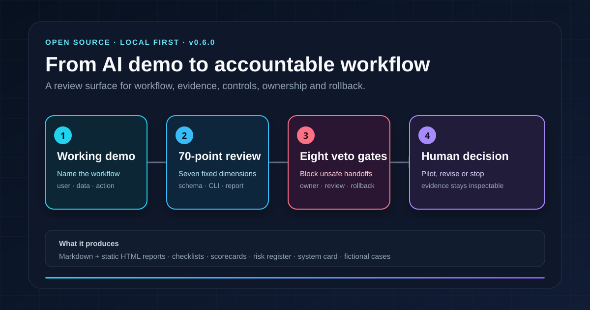
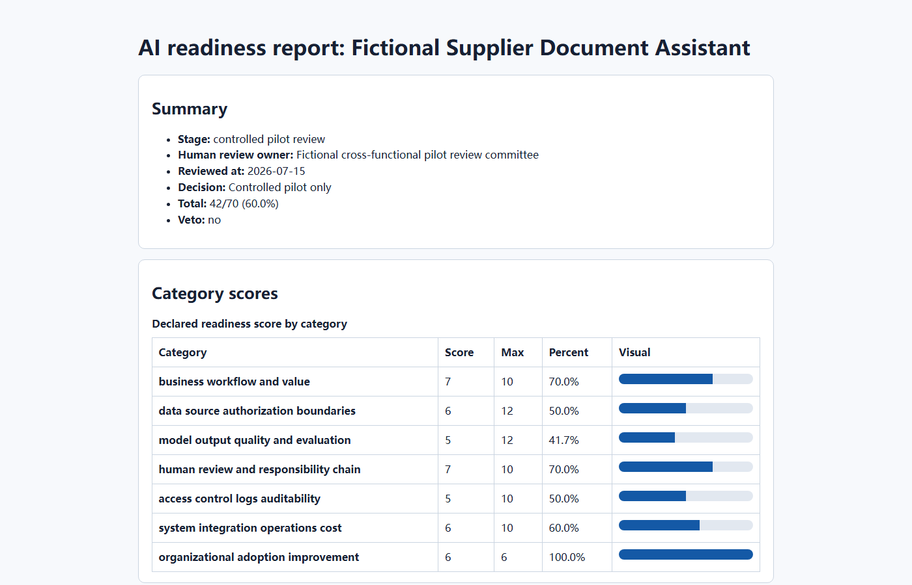
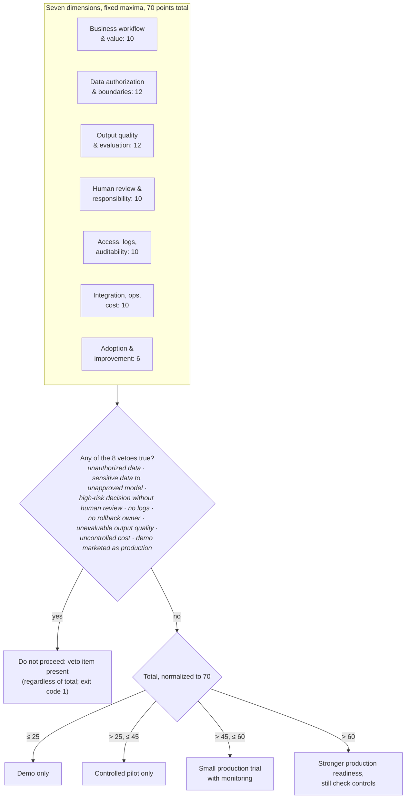
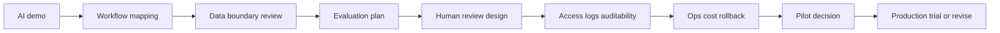

# AI Prototype-to-Production Toolkit


[](https://github.com/Anonymousyz/ai-prototype-to-production-toolkit/actions/workflows/validate.yml)

[中文说明](README.zh-CN.md)

<p align="center">
  
</p>

## Install and generate a sample report

```bash
python -m pip install "https://github.com/Anonymousyz/ai-prototype-to-production-toolkit/releases/download/v0.6.0/ai_ready-0.6.0-py3-none-any.whl"
ai-ready example --output assessment.json
ai-ready report assessment.json --format html --output report.html
```

The command creates a local, script-free report. Open `report.html` to inspect the declared score, veto state, category gaps and human review owner.

<p align="center">
  
</p>

Start with the [fictional assessment](examples/sample_assessment.json), the [copyable checklist](templates/ai_prototype_readiness_checklist.md), or the [generated report](examples/reports/sample_assessment_report.html). Found a gap in the method? Open a [field-test report](https://github.com/Anonymousyz/ai-prototype-to-production-toolkit/issues/new?template=field-test.yml) using public or synthetic material only.

A local-first toolkit for teams deciding whether an AI prototype has enough structure, evidence, and operating control to enter a bounded business workflow.

The toolkit is designed for the handoff between a working prototype and an accountable deployment decision. Product owners, forward-deployed engineers, solution architects, risk practitioners, security reviewers, and operating teams often look at the same system from different angles. This repository gives them a common review surface: workflow definition, data authorization, evaluation, human review, access and logging, operating ownership, cost, adoption, and rollback.

It includes a fixed 70-point local CLI, eight named veto conditions, JSON schema, checklists, scorecards, prompts, system documentation templates, risk and evaluation artifacts, pilot-memo templates, and four fictional assessment cases. The cases show controlled-pilot, small-production-trial, regulated-workflow, and veto behavior without exposing client or employer information.

> [!IMPORTANT]
> The score is an author-designed decision-support heuristic. It does not certify safety, compliance, security, fairness, or production approval. v0.6 preserves the seven dimensions, 70-point scale, and eight veto keys while adding an explicit schema version, safe v0.5 migration, and script-free static HTML reporting. The CLI validates declared structure; it does not verify source truth, reviewer identity, or real-world operating performance. Read the [method status and evidence boundary](docs/method_status.md) before using it in a material decision.

## What this toolkit is for

The unit of review is not an abstract model. It is an AI-enabled workflow that has a user, input sources, a decision or action point, affected stakeholders, an operating owner, and a failure path.

| Review layer | Question the team must answer | Example artifact |
|---|---|---|
| Business workflow | What decision or task changes, for whom, and how is value or harm observed? | workflow map, discovery guide, pilot memo |
| Data and authorization | What may the system read, retain, send, or prohibit? | data-boundary section, AI system card |
| Evaluation | What counts as acceptable output, failure, regression, or unacceptable risk? | evaluation plan, test cases, top gaps |
| Human responsibility | Who can approve, override, escalate, pause, or stop an action? | review design, veto record, decision owner |
| Operations | Who owns access, logs, cost, incidents, monitoring, support, and rollback? | risk register, runbook inputs, operating-owner record |

Teams need to answer these questions alongside model evaluation. The review makes missing conditions visible before the workflow reaches a broader pilot or production discussion.

---

## Review model

The toolkit brings workflow definition, evidence, controls, and operating responsibility into one review. It asks the team to document the user and decision point, data authorization, evaluation, human review, auditability, rollback, and ownership alongside model behavior.

Read the full [`MANIFESTO.md`](MANIFESTO.md) and [`docs/production_ready_ai_thesis.md`](docs/production_ready_ai_thesis.md).

---

## Use it when a prototype needs a bounded next step

Use this toolkit when a team needs to decide whether a prototype should stay in demonstration, enter a controlled pilot, or return for further work.

It helps the team answer:

1. What is clear enough for pilot?
2. What is still a blocker?
3. What evidence must be collected before production?
4. What should be automated, human-reviewed, or prohibited?
5. Which risks map to NIST AI RMF and OWASP LLM Top 10 concerns?

---

## Start with a workshop or local checkout

### Option A: human workshop

1. Copy [`templates/ai_prototype_readiness_checklist.md`](templates/ai_prototype_readiness_checklist.md).
2. Score the prototype with [`scorecards/ai_prototype_readiness_scorecard.md`](scorecards/ai_prototype_readiness_scorecard.md).
3. Fill [`templates/risk_register.md`](templates/risk_register.md).
4. Write a decision memo using [`templates/pilot_review_memo.md`](templates/pilot_review_memo.md).

### Option B: installable CLI

```bash
python -m venv .venv
# Windows: .venv\Scripts\activate
# macOS/Linux: source .venv/bin/activate
python -m pip install -e .
ai-ready score examples/sample_assessment.json
```

Expected output:

```text
System: Fictional Supplier Document Assistant
Stage: controlled pilot review
Review owner: Fictional cross-functional pilot review committee
Reviewed at: 2026-07-15
Decision: Controlled pilot only
Total: 42/70
Normalized: 42/70 (60.0%)
Veto: no
Top gaps:
- Evaluation set is too small
- Audit log design is incomplete
- Rollback owner is unclear
```

### How the score becomes a decision label

The CLI adds up seven fixed-maximum dimensions, then applies two rules in order: any true veto blocks deployment regardless of the total, and only then does the total map to a discussion tier.



The tier is a discussion label for the review meeting, not an approval. Tier boundaries are locked by regression tests.

Generate Markdown or static HTML:

```bash
ai-ready report examples/sample_assessment.json --output examples/reports/sample_assessment_report.md
ai-ready report examples/sample_assessment.json --format html --output examples/reports/sample_assessment_report.html
```

Migrate an unversioned v0.5 assessment without changing the source file:

```bash
ai-ready migrate legacy-v05.json --output assessment-v06.json
```

See [`docs/cli.md`](docs/cli.md), [`docs/demo.md`](docs/demo.md), and [`examples/terminal_demo.txt`](examples/terminal_demo.txt).

---

## Repository map

| Area | Files | Purpose |
|---|---|---|
| Orientation | [`README.md`](README.md), [`docs/quickstart_zh.md`](docs/quickstart_zh.md) | Explain the toolkit to public readers |
| Thought model | [`MANIFESTO.md`](MANIFESTO.md), [`docs/production_ready_ai_thesis.md`](docs/production_ready_ai_thesis.md) | Make the deployment philosophy explicit |
| Checklist | [`templates/ai_prototype_readiness_checklist.md`](templates/ai_prototype_readiness_checklist.md) | Assess deployment readiness across 7 dimensions |
| Score / CLI | [`scorecards/ai_prototype_readiness_scorecard.md`](scorecards/ai_prototype_readiness_scorecard.md), [`scripts/score_readiness.py`](scripts/score_readiness.py), [`src/ai_ready`](src/ai_ready), [`docs/cli.md`](docs/cli.md) | Validate, migrate, score, and generate text/JSON/Markdown/static HTML reports |
| Governance artifacts | [`templates/ai_system_card.md`](templates/ai_system_card.md), [`templates/risk_register.md`](templates/risk_register.md), [`templates/model_evaluation_plan.md`](templates/model_evaluation_plan.md) | Document system purpose, risk, evaluation and controls |
| FDE workflow | [`templates/fde_discovery_interview_guide.md`](templates/fde_discovery_interview_guide.md) | Guide discovery conversations with business teams |
| Prompts | [`prompts/ai_readiness_review_prompt.md`](prompts/ai_readiness_review_prompt.md), [`prompts/fde_case_study_prompt.md`](prompts/fde_case_study_prompt.md) | Use AI assistants to structure review and case writing |
| Crosswalks | [`docs/nist_ai_rmf_crosswalk.md`](docs/nist_ai_rmf_crosswalk.md), [`docs/owasp_llm_top10_mapping.md`](docs/owasp_llm_top10_mapping.md) | Map checklist to NIST and OWASP language |
| Method boundary | [`docs/method_status.md`](docs/method_status.md) | State the heuristic's limits and validation roadmap |
| Portfolio evidence map | [`docs/portfolio_evidence_map.md`](docs/portfolio_evidence_map.md) | Show what a technical, governance, or FDE interviewer can inspect and what the public artifacts do not prove |
| Eval integration | [`integrations/promptfoo/README.md`](integrations/promptfoo/README.md) | Show how authorized model-evaluation results can become human-reviewed evidence without auto-converting pass rates into readiness scores |
| Decision handoff | [`docs/readiness_to_decision_handoff.md`](docs/readiness_to_decision_handoff.md) | Move verified gaps and evidence into R2D without copying one toolkit's score into the other |
| Examples | [`docs/demo.md`](docs/demo.md), [`examples/sample_assessment.json`](examples/sample_assessment.json), [`examples/internal_policy_search_assistant.json`](examples/internal_policy_search_assistant.json), [`examples/customer_support_action_agent.json`](examples/customer_support_action_agent.json), [`examples/synthetic_industrial_safety_procedure_assistant.json`](examples/synthetic_industrial_safety_procedure_assistant.json) | Demonstrate controlled-pilot, small-production-trial, veto, and regulated-workflow behavior |
| Packaging and CI | [`pyproject.toml`](pyproject.toml), [`.github/workflows/validate.yml`](.github/workflows/validate.yml) | Install locally; the validation workflow runs on every push (Python 3.9/3.11/3.12) and is documented in [`docs/github_actions_validate.template.yml`](docs/github_actions_validate.template.yml) |
| Public writing | [`articles/001_from_ai_demo_to_production.md`](articles/001_from_ai_demo_to_production.md), [`articles/002_ai_deployment_is_a_responsibility_problem.md`](articles/002_ai_deployment_is_a_responsibility_problem.md) | Technical-report style articles for GitHub |
| Benchmarking | [`docs/benchmark_gap_analysis.md`](docs/benchmark_gap_analysis.md), [`SOURCES.md`](SOURCES.md) | Explain what high-quality projects were benchmarked |

This repository is one part of a public operating path. For a conversational first pass, the [AI Launch Red Team skill](https://github.com/Anonymousyz/ai-launch-red-team) runs the same eight vetoes against a pasted launch plan inside Claude Code, Cursor, or Codex. Use the [Awesome AI Production Readiness list](https://github.com/Anonymousyz/awesome-ai-production-readiness) to identify tools for a gap, then use the [Research-to-Decision Toolkit](https://github.com/Anonymousyz/research-to-decision-toolkit) when a readiness assessment must become a human decision packet.

---

## Core framework

A deployment review should cover seven dimensions:

1. **Business workflow and value:** Which workflow changes, and how is value measured?
2. **Data source, authorization, and boundaries:** What data is used, and under what authorization?
3. **Model output quality and evaluation:** How are quality, hallucination, failure, and regression measured?
4. **Human review and responsibility chain:** Which actions need human review, and who owns mistakes?
5. **Access control, logs, and auditability:** Can the team prove who did what, when, with which model/prompt/version?
6. **System integration, operations, and cost:** Can the system survive failure, rollback, cost spikes, and ownership changes?
7. **Organizational adoption and continuous improvement:** Will real users adopt it, and how will feedback improve the workflow?



---

## Where it fits

Use this toolkit alongside evaluation, observability, guardrail, and responsible-AI tools. Those tools address particular technical or control questions; this toolkit records the workflow, evidence, controls, and operating responsibility needed for a deployment discussion.

| Tool category | Examples | What they are strong at | This toolkit adds |
|---|---|---|---|
| Evals/testing | OpenAI Evals, promptfoo, DeepEval, RAGAS | Metrics, test cases, regression, CI | Business workflow, governance, role ownership, go/no-go decisions |
| Observability | Phoenix, Opik | Tracing, monitoring, experiments | Pre-production readiness and governance evidence |
| Guardrails/security | NeMo Guardrails, Guardrails AI, OWASP LLM Top 10 | Input/output controls, security risk taxonomy | Cross-functional deployment checklist and pilot memo |
| Responsible AI | Microsoft Responsible AI Toolbox, Fairlearn, AIF360, Model Card Toolkit | Fairness, explainability, model documentation | Lightweight enterprise AI system card + risk register |
| Human-centered AI | Google PAIR Guidebook | User autonomy, feedback, error recovery | Production readiness framing for enterprise workflows |

---

## Limits

This toolkit is **not**:

- legal advice;
- security audit;
- medical, financial, or certification advice;
- a substitute for professional compliance review;
- a guarantee that an AI system is safe or production-ready.

Use it as a structured starting point for product, governance, risk, compliance, and deployment discussions.

The current release uses a fixed but uncalibrated 70-point scale. Every dimension requires referenced evidence, a named reviewer and assessment date are mandatory, and all eight veto keys must be declared. These checks are structural: unresolved vetoes cannot be offset by a high total, and the CLI does not authenticate evidence or reviewer identity.

---

## Chinese summary / 中文简介

完整中文版见 [README.zh-CN.md](README.zh-CN.md)，起步说明见 [docs/quickstart_zh.md](docs/quickstart_zh.md)。

这是一套面向 **FDE / AI 落地 / AI 治理 / 受监管行业部署** 的公开工具箱，用来判断一个 AI 原型是否具备进入真实业务流程的就绪度。

它不是单篇文章，也不是单条 prompt，而是：

- readiness checklist；
- scorecard；
- risk register；
- AI system card；
- FDE discovery interview guide；
- prompt templates；
- fictional case；
- NIST AI RMF / OWASP LLM Top 10 对照；
- 一个可安装运行、可迁移 v0.5 输入并生成 Markdown/JSON/静态 HTML 报告的 CLI；
- 四个分别展示“受控试点、小规模生产试验、一票否决、受监管工业流程”的虚构案例。

---

## Roadmap

The next evidence-bearing milestones are documented in [`docs/roadmap.md`](docs/roadmap.md): broader tests, independent rubric review, more cases, a stable package release, and real-world feedback that can be published without disclosing confidential data.

---

## License

MIT License. See [`LICENSE`](LICENSE).

---

## Sources and benchmark projects

See [`SOURCES.md`](SOURCES.md) and [`docs/benchmark_gap_analysis.md`](docs/benchmark_gap_analysis.md).
