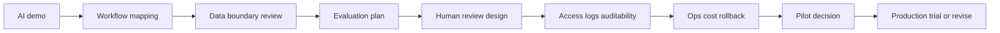

# AI Prototype-to-Production Toolkit


A practical toolkit for assessing whether an AI prototype is ready to move into production.

This repository provides **checklists, scorecards, prompts, templates, an installable CLI, a sample scoring script, and fictional case examples** for teams working on AI deployment in enterprise, public-sector, and regulated environments.

> Many AI demos look impressive. Production deployment is different: business workflow, data boundaries, model evaluation, human review, access control, audit logging, cost ownership, rollback, and organizational adoption all matter.

---

## 30-second value proposition

Use this toolkit when a team says:

> “The AI demo works. Can we put it into the real workflow next month?”

This toolkit helps you answer:

1. What is clear enough for pilot?
2. What is still a blocker?
3. What evidence must be collected before production?
4. What should be automated, human-reviewed, or prohibited?
5. Which risks map to NIST AI RMF and OWASP LLM Top 10 concerns?

---

## Quick start

### Option A — human workshop

1. Copy [`templates/ai_prototype_readiness_checklist.md`](templates/ai_prototype_readiness_checklist.md).
2. Score the prototype with [`scorecards/ai_prototype_readiness_scorecard.md`](scorecards/ai_prototype_readiness_scorecard.md).
3. Fill [`templates/risk_register.md`](templates/risk_register.md).
4. Write a decision memo using [`templates/pilot_review_memo.md`](templates/pilot_review_memo.md).

### Option B — installable CLI

```bash
python -m venv .venv
# Windows: .venv\Scripts\activate
# macOS/Linux: source .venv/bin/activate
python -m pip install -e .
ai-ready score examples/sample_assessment.json
```

Expected output:

```text
System: Fictional Supplier Document Assistant
Stage: controlled pilot review
Decision: Controlled pilot only
Total: 42/70
Normalized: 42/70 (60.0%)
Veto: no
Top gaps:
- Evaluation set is too small
- Audit log design is incomplete
- Rollback owner is unclear
```

Generate a Markdown report:

```bash
ai-ready report examples/sample_assessment.json --output examples/reports/sample_assessment_report.md
```

See [`docs/cli.md`](docs/cli.md) and [`examples/terminal_demo.txt`](examples/terminal_demo.txt).

---

## Repository map

| Area | Files | Purpose |
|---|---|---|
| Orientation | [`README.md`](README.md), [`docs/quickstart_zh.md`](docs/quickstart_zh.md) | Explain the toolkit to public readers |
| Checklist | [`templates/ai_prototype_readiness_checklist.md`](templates/ai_prototype_readiness_checklist.md) | Assess deployment readiness across 7 dimensions |
| Score / CLI | [`scorecards/ai_prototype_readiness_scorecard.md`](scorecards/ai_prototype_readiness_scorecard.md), [`scripts/score_readiness.py`](scripts/score_readiness.py), [`src/ai_ready`](src/ai_ready), [`docs/cli.md`](docs/cli.md) | Convert qualitative review into a decision and Markdown report |
| Governance artifacts | [`templates/ai_system_card.md`](templates/ai_system_card.md), [`templates/risk_register.md`](templates/risk_register.md), [`templates/model_evaluation_plan.md`](templates/model_evaluation_plan.md) | Document system purpose, risk, evaluation and controls |
| FDE workflow | [`templates/fde_discovery_interview_guide.md`](templates/fde_discovery_interview_guide.md) | Guide discovery conversations with business teams |
| Prompts | [`prompts/ai_readiness_review_prompt.md`](prompts/ai_readiness_review_prompt.md), [`prompts/fde_case_study_prompt.md`](prompts/fde_case_study_prompt.md) | Use AI assistants to structure review and case writing |
| Crosswalks | [`docs/nist_ai_rmf_crosswalk.md`](docs/nist_ai_rmf_crosswalk.md), [`docs/owasp_llm_top10_mapping.md`](docs/owasp_llm_top10_mapping.md) | Map checklist to NIST and OWASP language |
| Examples | [`examples/fictional_ai_document_assistant_review.md`](examples/fictional_ai_document_assistant_review.md), [`examples/sample_assessment.json`](examples/sample_assessment.json) | Show what a review looks like |
| Packaging | [`pyproject.toml`](pyproject.toml), [`docs/github_actions_validate.template.yml`](docs/github_actions_validate.template.yml) | Install locally and validate via CI |
| Public writing | [`articles/001_from_ai_demo_to_production.md`](articles/001_from_ai_demo_to_production.md) | Technical-report style article for GitHub |
| Benchmarking | [`docs/benchmark_gap_analysis.md`](docs/benchmark_gap_analysis.md), [`SOURCES.md`](SOURCES.md) | Explain what high-quality projects were benchmarked |

---

## Core framework

A prototype becomes production-ready only when the team can answer questions across seven dimensions:

1. **Business workflow and value** — Which workflow changes, and how is value measured?
2. **Data source, authorization, and boundaries** — What data is used, and under what authorization?
3. **Model output quality and evaluation** — How are quality, hallucination, failure, and regression measured?
4. **Human review and responsibility chain** — Which actions need human review, and who owns mistakes?
5. **Access control, logs, and auditability** — Can the team prove who did what, when, with which model/prompt/version?
6. **System integration, operations, and cost** — Can the system survive failure, rollback, cost spikes, and ownership changes?
7. **Organizational adoption and continuous improvement** — Will real users adopt it, and how will feedback improve the workflow?



---

## What makes this different

This is **not** an LLM evaluation framework like OpenAI Evals, promptfoo, DeepEval, Phoenix, Opik, or RAGAS.

It is a **deployment readiness layer** that sits before or beside those tools:

| Tool category | Examples | What they are strong at | This toolkit adds |
|---|---|---|---|
| Evals/testing | OpenAI Evals, promptfoo, DeepEval, RAGAS | Metrics, test cases, regression, CI | Business workflow, governance, role ownership, go/no-go decisions |
| Observability | Phoenix, Opik | Tracing, monitoring, experiments | Pre-production readiness and governance evidence |
| Guardrails/security | NeMo Guardrails, Guardrails AI, OWASP LLM Top 10 | Input/output controls, security risk taxonomy | Cross-functional deployment checklist and pilot memo |
| Responsible AI | Microsoft Responsible AI Toolbox, Fairlearn, AIF360, Model Card Toolkit | Fairness, explainability, model documentation | Lightweight enterprise AI system card + risk register |
| Human-centered AI | Google PAIR Guidebook | User autonomy, feedback, error recovery | Production readiness framing for enterprise workflows |

---

## What this is not

This toolkit is **not**:

- legal advice;
- security audit;
- medical, financial, or certification advice;
- a substitute for professional compliance review;
- a guarantee that an AI system is safe or production-ready.

It is a structured starting point for product, governance, risk, compliance, and deployment discussions.

---

## Chinese summary / 中文简介

这是一套面向 **FDE / AI 落地 / AI 治理 / 受监管行业部署** 的公开工具箱，用来判断一个 AI 原型是否具备进入真实业务流程的准备度。

它不是单篇文章，也不是单条 prompt，而是：

- readiness checklist；
- scorecard；
- risk register；
- AI system card；
- FDE discovery interview guide；
- prompt templates；
- fictional case；
- NIST AI RMF / OWASP LLM Top 10 对照；
- 一个可运行的样例评分脚本。

---

## Growth and launch

This repository is designed as a public portfolio and open-source toolkit. See:

- [`docs/star_growth_strategy.md`](docs/star_growth_strategy.md)
- [`docs/launch_playbook.md`](docs/launch_playbook.md)
- [`docs/roadmap.md`](docs/roadmap.md)

---

## License

MIT License. See [`LICENSE`](LICENSE).

---

## Sources and benchmark projects

See [`SOURCES.md`](SOURCES.md) and [`docs/benchmark_gap_analysis.md`](docs/benchmark_gap_analysis.md).
