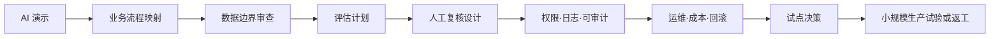
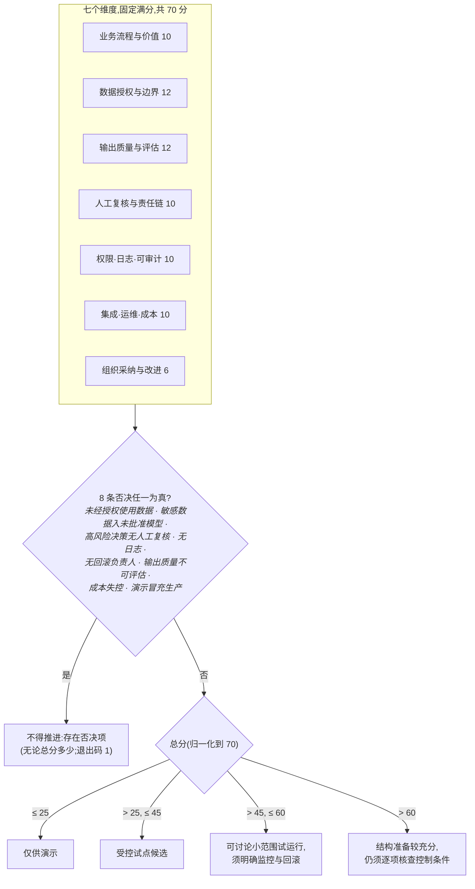

# AI Prototype-to-Production Toolkit（AI 原型上线评审工具包）


[](https://github.com/Anonymousyz/ai-prototype-to-production-toolkit/actions/workflows/validate.yml)

[English README](README.md) · [中文起步说明](docs/quickstart_zh.md)

这个本地优先工具包用于评审 AI 原型进入真实业务前的准备情况。

评审对象不是抽象模型，而是一条 AI 业务流程：谁使用它、输入来自哪里、它影响什么决定或动作、出了问题谁处理、怎样暂停或回滚。模型表现只是其中一项材料；数据授权、评估证据、人工复核、审计记录、运行成本和事故处置也要一并说明。

> [!IMPORTANT]
> 评分是作者设计、未经外部校准的决策支持启发式。它不认证安全、合规或公平，也不构成上线批准。CLI 只检查提交材料的结构，不能核实证据真伪、评审人身份或实际运行表现。使用前请阅读[方法边界](docs/method_status.md)。

## 评审所面对的对象

工具把业务流程、数据边界、评估、人工复核、权限与日志、运行和回滚放进同一份材料。团队据此讨论下一步是补充材料、进入受控试点，还是暂缓推进。

## 生成一份示例报告

```bash
python -m pip install "https://github.com/Anonymousyz/ai-prototype-to-production-toolkit/releases/download/v0.6.0/ai_ready-0.6.0-py3-none-any.whl"
ai-ready example --output assessment.json
ai-ready report assessment.json --format html --output report.html
```

打开 `report.html`，查看申报得分、否决状态、各维度缺口和人工复核负责人。本地源码安装则用 `pip install -e .`。

`ai-ready score examples/sample_assessment.json` 的预期输出:

```text
System: Fictional Supplier Document Assistant
Stage: controlled pilot review
Review owner: Fictional cross-functional pilot review committee
Reviewed at: 2026-07-15
Decision: Controlled pilot only
Total: 42/70
Normalized: 42/70 (60.0%)
Veto: no
Top gaps:
- Evaluation set is too small
- Audit log design is incomplete
- Rollback owner is unclear
```

## 评审框架：七个维度

七个维度分别追问业务流程、数据、评估、复核、可追溯性、运行和组织采纳。缺少其中任何一项，都应在评审材料中写明。



| 评审层 | 团队必须回答 | 对应产物 |
|---|---|---|
| 业务流程与价值 | 哪个决策或任务被改变?价值和损害如何观测? | 流程图、调研指南、试点备忘录 |
| 数据与授权 | 系统可以读取、留存、外发什么?禁止什么? | 数据边界申报、AI 系统卡 |
| 输出质量与评估 | 什么算合格输出、失败、回归、不可接受的风险? | 评估计划、测试用例、缺口清单 |
| 人工复核与责任链 | 谁能批准、推翻改判、升级上报、暂停、叫停?出错谁负责? | 复核设计、否决记录、决策负责人 |
| 运行 | 权限、日志、成本、事故、监控、回滚归谁? | 风险登记册、运行手册输入 |

## 分数如何变成决策标签

CLI 先汇总七个固定满分的维度，再检查否决条件。任一否决项为真时，结果不会因总分较高而改变；没有否决项时，总分只用于标示评审讨论所处的档位。



这些档位只用于帮助评审会议集中讨论缺口，不代表批准；档位边界由回归测试锁定。

## 快速开始

### 方式 A:工作坊(不写代码)

1. 复制[就绪度检查清单](templates/ai_prototype_readiness_checklist.md),团队各角色对照打分([计分卡](scorecards/ai_prototype_readiness_scorecard.md));
2. 填写[风险登记册](templates/risk_register.md)与 [AI 系统卡](templates/ai_system_card.md);
3. 用[试点评审备忘录](templates/pilot_review_memo.md)形成书面决定。

### 方式 B:CLI

```bash
python -m venv .venv
# Windows: .venv\Scripts\activate
# macOS/Linux: source .venv/bin/activate
python -m pip install -e .
ai-ready score examples/sample_assessment.json
ai-ready report examples/sample_assessment.json --format html --output report.html
ai-ready migrate legacy-v05.json --output assessment-v06.json
```

命令、退出码、v0.5 迁移与输入契约见 [`docs/cli.md`](docs/cli.md);输入文件接受带或不带 BOM 的 UTF-8。

## 四个虚构案例

| 案例 | 演示的行为 |
|---|---|
| [供应商文档助手](examples/sample_assessment.json) | 42/70,受控试点档 |
| [内部制度检索助手](examples/internal_policy_search_assistant.json) | 52/70,小规模生产试验档(四例中就绪度最高) |
| [客服自动操作代理](examples/customer_support_action_agent.json) | 触发两条否决,无论总分多少均判"不得推进",退出码 1 |
| [工业安全规程助手](examples/synthetic_industrial_safety_procedure_assistant.json) | 受监管流程语境,44/70 |

案例全部虚构,不含任何客户、雇主或真实运营数据。

## 仓库地图(节选)

| 用途 | 位置 |
|---|---|
| 方法立场与论文式阐述 | [`MANIFESTO.md`](MANIFESTO.md)、[`docs/production_ready_ai_thesis.md`](docs/production_ready_ai_thesis.md) |
| 检查清单与计分卡 | [`templates/`](templates/)、[`scorecards/`](scorecards/) |
| CLI 源码与 JSON Schema | [`src/ai_ready`](src/ai_ready)、[`schemas/readiness_assessment.schema.json`](schemas/readiness_assessment.schema.json) |
| NIST AI RMF / OWASP LLM Top 10 对照 | [`docs/nist_ai_rmf_crosswalk.md`](docs/nist_ai_rmf_crosswalk.md)、[`docs/owasp_llm_top10_mapping.md`](docs/owasp_llm_top10_mapping.md) |
| 评估结果→就绪证据的受控接入 | [`integrations/promptfoo/`](integrations/promptfoo/) |
| 就绪评估→决策包的交接 | [`docs/readiness_to_decision_handoff.md`](docs/readiness_to_decision_handoff.md) |
| 方法边界与校准路线 | [`docs/method_status.md`](docs/method_status.md)、[`docs/roadmap.md`](docs/roadmap.md) |
| 持续集成 | [`.github/workflows/validate.yml`](.github/workflows/validate.yml)(Python 3.9/3.11/3.12,每次 push 运行) |

配套仓库:想先来一轮对话式快检,用 [AI 上线否决卡技能](https://github.com/Anonymousyz/ai-launch-red-team)(同一套 8 条否决,粘贴方案即可红队);先用 [Awesome AI Production Readiness](https://github.com/Anonymousyz/awesome-ai-production-readiness) 找工具补缺口,评估要变成负责人可拍板的决策包时用 [Research-to-Decision Toolkit](https://github.com/Anonymousyz/research-to-decision-toolkit)。

## 边界

本工具包用于结构化评审，不提供法律、安全、医疗或金融意见，也不能替代专业合规审查。70 分制固定但未经校准；每个维度要求列出证据引用，评审人姓名与日期为必填，八条否决须逐条申报。未解决的否决项不能用高分抵消，CLI 也不会核实证据和评审人身份。

## 许可证

MIT,见 [`LICENSE`](LICENSE)。
